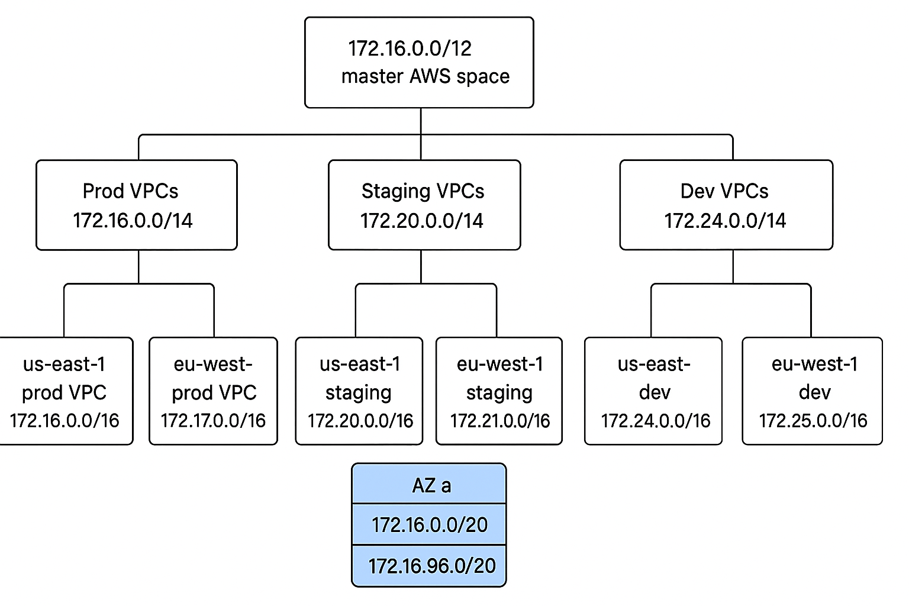

# Detailed Design & Implementation
For the first phase, we will implement a simplified version of 3-tier architecture with the following components:
- VPC with public and private subnets across 3 AZs, 2 regions (ap-southeast-2, ap-northeast-2), 3 environments (Dev, Staging, Prod).
- 1 public subnet for web tier, 1 private subnet for application tier, 1 private subnet for database tier in each AZ.
- Internet Gateway for public subnet access to/from internet.
- NAT Gateways in public subnets for outbound internet access from private subnets.
- Route Tables for routing rules.
- Security Groups for network security.
- Route53 DNS with health checks and failover routing.
- Amazon WAF (Web Application Firewall) for security.
- Application Load Balancer (ALB) in public subnets to access Web Tier.
- Application Load Balancer (ALB) in private subnets to access Application Tier.
- Auto Scaling Groups (ASG) for web and application tiers.
- Amazon EC2 instances in public subnets for web tier.
- Amazon EC2 instances in private subnets for application tier.
- Amazon ElastiCache (Redis) in private subnets for caching (application tier).
- Amazon RDS (PostgreSQL) in private subnets for database tier.

Extra components:
- S3 for object storage (e.g. static assets, backups).
- CloudWatch for monitoring and logging.
- IAM roles and policies for least privilege access.
- CloudTrail for auditing and compliance.
- KMS for encryption key management.
- Secrets Manager for managing sensitive information (e.g. DB credentials, API keys).

> Note that this is not the final architecture (described in [main-architecture-setup.md](./main-architecture-setup.md)), but a simplified version to get started quickly. Future phases will enhance the architecture with more advanced features like EKS, CI/CD, monitoring, logging, security, etc.*

## VPC and Networking

### VPC CIDR Allocation Blueprint (multi-environment, multi-region)
- In total, 6 VPCs, including:
    - 3 environments: Dev, Staging, Prod.
    - 2 regions: ap-southeast-2, ap-northeast-2.
- Each VPC gets /16 (65k IPs) to leave headroom for EKS clusters, microservices, scaling.
- Subnets: /20 (4k IPs each) per AZ, which balances enough IPs vs not too large.

### VPC per environment per region
#### 1. VPC Schema
```
172.16.0.0/12   ← Master AWS space (a large RFC1918 space)
  172.16.0.0/14     Prod VPCs (4x /16 blocks for future prod growth)
  172.20.0.0/14     Staging VPCs
  172.24.0.0/14     Dev VPCs
```

#### 2. VPC CIDR Table

| Region         | Environment    | VPC CIDR       |
|----------------|----------------|----------------|
| ap-southeast-2 | Dev            | 172.16.0.0/16  |
|                | Staging        | 172.20.0.0/16  |
|                | Prod           | 172.24.0.0/16  |
| ap-northeast-2 | Dev            | 172.17.0.0/16  |
|                | Staging        | 172.21.0.0/16  |
|                | Prod           | 172.25.0.0/16  |

#### 3. Subdivide inside each VPC (subnets)
- Take one VPC (172.16.0.0/16 prod-ap-southeast-2). Split into /20 subnets
- Still leaves room for future subnets (unused space in the /16 for future growth).
- In total, 9 subnets (3 per AZ x 3 AZs) per VPC, 36 subnets total.

| AZ              | Subnet Type     | CIDR            | Purpose                            |
|-----------------|-----------------|-----------------|------------------------------------|
| ap-southeast-2a | Public          | 172.16.0.0/20   | Public-facing resources (NLB, ALB) |
|                 | Private         | 172.16.16.0/20  | Application servers (ECS, EC2)     |
|                 | Private         | 172.16.32.0/20  | Databases (RDS, ElastiCache)       |
| ap-southeast-2b | Public          | 172.16.48.0/20  | Public-facing resources (NLB, ALB) |
|                 | Private         | 172.16.64.0/20  | Application servers (ECS, EC2)     |
|                 | Private         | 172.16.80.0/20  | Databases (RDS, ElastiCache)       |
| ap-southeast-2c | Public          | 172.16.96.0/20  | Public-facing resources (NLB, ALB) |
|                 | Private         | 172.16.112.0/20 | Application servers (ECS, EC2)     |
|                 | Private         | 172.16.128.0/20 | Databases (RDS, ElastiCache)       |

### Final hirearchy visualization



## Route Tables
- Public Route Table connects the public subnets to **Internet Gateway**
- Private Route Table connects private subnets to **NAT Gateway** in public subnet

## Route53 DNS
- DNS + Health Checks
- Failover routing to Multi-Region
- Custom domain with TLS certificates via ACM

## Amazon WAF
- Filter and monitor HTTP/HTTPS requests to web applications.
- Protect public ALBs

## Application Load Balancer (ALB)
### Public ALB
- Public ALB in public subnets to route external traffic to internal services.
- HTTPS (ACM cert) termination at ALB.
- Security Group: 80 (HTTP), 443 (HTTPS) from Internet

### Private ALB
- Private ALB in private subnets to route internal traffic between services (web tier to app tier).
- Security Group: 3000 (app port) from web tier SG only.

## Auto Scaling Groups (ASG)
- ASG for web tier EC2 instances in public subnets.
- ASG for application tier EC2 instances in private subnets.
- Scaling policies based on CPU utilization, request count, etc.

## EC2 Templates
- Use Launch Templates for EC2 instance configuration.
- Web Tier: **User data** to install needed software (e.g. Node.js)
- Application Tier: **User data** to install needed software (e.g. Python packages)
- Use IAM roles for least privilege access to AWS services (e.g. S3, RDS).

## Amazon ElastiCache (Redis)
- `Redis` (cluster mode disabled) in private subnets (application tier) for caching.
- Security Group: allow access from application tier SG only.

## Amazon RDS (PostgreSQL)
- RDS PostgreSQL in private subnets (database tier) for relational database.
- Multi-AZ deployment for high availability.
- Security Group: allow access from application tier SG only.
- Enable automated backups, snapshots, and monitoring. (to be configured later)

## Extra Components
### S3
- S3 buckets for object storage (e.g. static assets, backups).
- Use bucket policies and IAM roles for secure access.

### CloudWatch
- Monitor EC2, RDS, ElastiCache metrics.
- Set up alarms for critical metrics (e.g. CPU, memory, disk space).
- Use CloudWatch Logs for application and system logs.

### IAM Roles and Policies
- Create IAM roles for EC2 instances with least privilege access.
- Use IAM policies to restrict access to only necessary AWS resources.

### CloudTrail
- Enable CloudTrail for auditing and compliance.
- Log all API calls and activities in the AWS account. (to be configured later)

### KMS (configured later)
- Use KMS for encryption key management.
- Encrypt sensitive data at rest (e.g. RDS, S3).

### Secrets Manager (configured later)
- Use Secrets Manager to manage sensitive information (e.g. DB credentials, API keys).
- Rotate secrets automatically for enhanced security.

## Future Enhancements
- Multi-account architecture for isolation and security: Prod in one account, Dev/Staging in another.